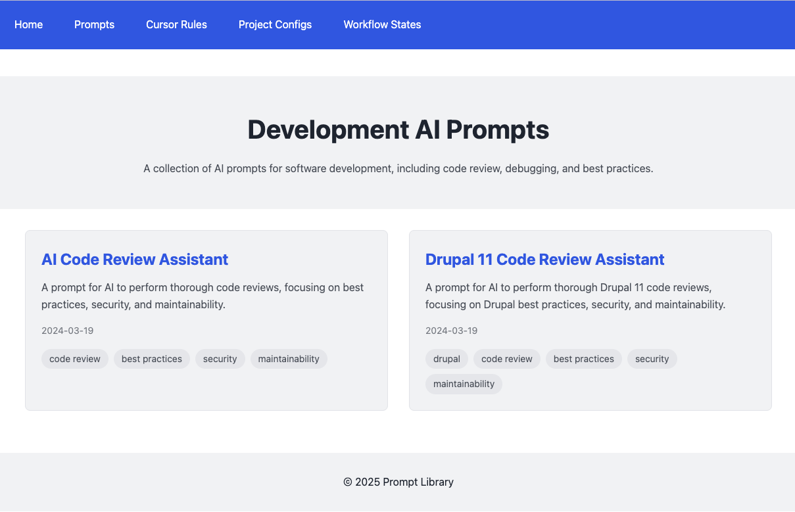

# Prompt Library

A collection of AI prompts, rules (guidelines for development environments), project configurations, and workflow states across different disciplines. Built with 11ty and hosted on GitHub Pages.



## Features

- Clean, modern design
- Responsive layout
- Easy navigation
- Search functionality
- Content categorization by discipline
- Markdown support

## Getting Started

### Prerequisites

- Node.js (v16 or higher)
- npm or yarn
- Git

### Installation

1. Clone the repository
```bash
git clone https://github.com/yourusername/prompt-library.git
cd prompt-library
```

2. Install dependencies
```bash
npm install
```

3. Start the development server
```bash
npm start
```

4. Build for production
```bash
npm run build
```

## Project Structure

```
├── _data/              # Global data files
├── _includes/          # Includes and partials
├── _layouts/           # Page templates
│   ├── base.njk        # Base layout
│   ├── discipline.njk  # Discipline-specific layout
│   └── content-type.njk # Content type layout
├── assets/             # Static assets
│   ├── css/           # Stylesheets
│   ├── js/            # JavaScript files
│   └── images/        # Image assets
├── development/        # Development discipline content
│   ├── prompts/       # Development prompts
│   ├── rules/  # Development rules
│   ├── project-configs/ # Development project configs
│   └── workflow-states/ # Development workflow states
├── project-management/ # Project Management discipline content
│   ├── prompts/
│   ├── rules/
│   ├── project-configs/
│   └── workflow-states/
├── sales-marketing/    # Sales & Marketing discipline content
│   ├── prompts/
│   ├── rules/
│   ├── project-configs/
│   └── workflow-states/
├── content-strategy/   # Content Strategy discipline content
│   ├── prompts/
│   ├── rules/
│   ├── project-configs/
│   └── workflow-states/
├── design/            # Design discipline content
│   ├── prompts/
│   ├── rules/
│   ├── project-configs/
│   └── workflow-states/
├── quality-assurance/        # Quality Assurance discipline content
│   ├── prompts/        # Quality Assurance prompts and checklists
│   ├── rules/   # Quality Assurance-specific rules and guidelines for maintaining consistency
│   ├── project-configs/ # Quality Assurance tool or process configurations
│   └── workflow-states/ # Quality Assurance workflow documentation
├── .github/           # GitHub configuration
│   └── workflows/     # GitHub Actions workflows
├── .eleventy.js       # 11ty configuration
├── .gitignore
├── package.json
└── README.md
```

## Content Organization

The library is organized by disciplines and content types:

### Disciplines
- Development
- Project Management
- Sales & Marketing
- Content Strategy
- Design
- Quality Assurance

### Content Types
- Prompts: AI prompts for various use cases
- Rules: Guidelines for development environments
- Project Configs: Project configuration templates
- Workflow States: Process and workflow documentation

Each discipline contains all content types, allowing for specialized content within each field.

## Contributing

1. Fork the repository
2. Create your feature branch (`git checkout -b feature/amazing-feature`)
3. Commit your changes (`git commit -m 'Add some amazing feature'`)
4. Push to the branch (`git push origin feature/amazing-feature`)
5. Open a Pull Request

- [Submit a Prompt](https://github.com/Lullabot/prompt_library/issues/new?template=prompt-submission.yml) - Share AI prompts for various use cases
- [Submit a Rule](https://github.com/Lullabot/prompt_library/issues/new?template=rule-submission.yml) - Contribute guidelines for development environments
- [Submit a Project Config](https://github.com/Lullabot/prompt_library/issues/new?template=project-config-submission.yml) - Share project configuration templates
- [Submit a Workflow State](https://github.com/Lullabot/prompt_library/issues/new?template=workflow-state-submission.yml) - Contribute process and workflow documentation

## License

This project is licensed under the ISC License.

## Acknowledgments

- [11ty](https://www.11ty.dev/)
- [GitHub Pages](https://pages.github.com/) 