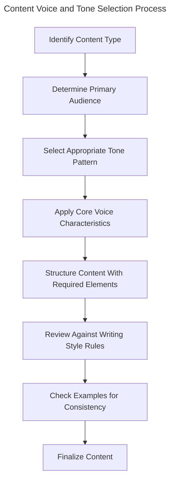

```text
---
description: MAINTAIN consistent brand voice and tone when WRITING CONTENT to ENSURE clear and effective communication
globs: *.md,*.txt
alwaysApply: false
---
# Voice and Tone Standards

<version>1.0.0</version>

## Context
- Apply when writing or editing any client-facing content
- Used to maintain brand consistency across all communications
- Essential for conveying professionalism and expertise

## Requirements
- Adhere to core voice characteristics
- Adapt tone to match specific content types
- Structure content for maximum clarity and impact
- Follow specific writing style rules
- Incorporate brand reinforcement naturally

## Core Voice Characteristics

All content should consistently embody these qualities:

- **Knowledgeable**: Demonstrate deep technical understanding and industry expertise
- **Empowering**: Give readers actionable insights they can implement
- **Conversational**: Use natural language with "you" for readers and "we" for the company
- **Clear and Simple**: Break down complex concepts without oversimplification
- **Helpful**: Focus on solving problems and providing practical value
- **Respectful**: Maintain professional courtesy toward all mentioned parties

## Tone Patterns by Content Type

- **Technical Tutorials**: Confident and instructional, not condescending
- **Case Studies**: Confident but humble, focusing on lessons learned
- **Industry Insights**: Thoughtful and analytical with measured opinions
- **Company Culture**: Warm and authentic with personal touches
- **Client Communications**: Professional, responsive, and solutions-oriented

## Structural Elements

Essential components for all content:

- Relevant, approachable introduction
- Clear problem statement or purpose declaration
- Logical progression from general to specific
- Defined technical terms on first use
- Practical examples illustrating concepts
- Actionable takeaways or next steps

## Writing Style Rules

1. Use second-person ("you") to address the reader
2. Represent the company with "we" (first-person plural)
3. Keep paragraphs short (3-4 sentences maximum)
4. Vary sentence length for rhythm and readability
5. Use active voice predominantly
6. Break text with meaningful headings and subheadings
7. Define technical terms for broader audience understanding
8. Follow American English spelling conventions
9. Avoid idioms and unnecessary metaphors for global accessibility

## Avoid Idioms and Unnecessary Metaphors

While colorful language can add personality to writing, idioms and metaphors often create barriers for our global audience and can make content sound artificial or overly casual. As a general rule, choose clear, direct language over idiomatic expressions.

### Why Avoid Idioms?

- **Accessibility for Non-Native Speakers**: Our audience includes developers, strategists, and business stakeholders worldwide. Idioms don't translate well and can confuse readers whose first language isn't English.
- **Professional Clarity**: Technical content requires precision. Idioms can muddy meaning and distract from your core message.
- **Avoiding "AI-Generated" Sound**: Overuse of idioms and clichéd metaphors can make content sound generic or artificially generated.
- **Better SEO Performance**: Search engines and readers alike prefer clear, descriptive language over figurative expressions.
- **Inclusive Communication**: Direct language ensures all readers, regardless of cultural background or reading level, can understand your content.

### Examples: Do and Don't

#### ❌ DON'T Use These Idioms

- Instead of: "This API integration was a piece of cake." Write: "This API integration was straightforward to implement."
- Instead of: "This legacy code is a can of worms." Write: "This legacy code presents multiple interconnected challenges."

#### ✅ DO Use Clear, Direct Language

- Good: "The database optimization reduced page load times by 40%." Better than: "The database optimization was a game-changer for page speed."
- Good: "We identified three critical security vulnerabilities." Better than: "We found some real red flags in the security audit."

### When Metaphors Work

Metaphors can be effective when they:

- Clarify complex technical concepts
- Are widely understood across cultures
- Add genuine value to comprehension

**Effective metaphor**: "Database indexes work like a book's table of contents—they help you find information quickly without scanning every page."

**Ineffective metaphor**: "Our development workflow is smoother than butter on a hot skillet."

### Quick Self-Check

Before publishing, scan your content for:

- Phrases that don't translate literally
- Expressions your international colleagues might not understand
- Overused business clichés
- Metaphors that don't enhance understanding

**Remember**: When in doubt, choose clarity over cleverness.

## Examples

<example>
**Technical Introduction**

"Managing content across multiple platforms presents unique challenges for enterprise organizations. At Lullabot, we've helped companies like NBC solve these exact problems. Here's how you can implement a similar approach for your content architecture."

This example demonstrates expertise, addresses the reader directly, establishes credibility, and promises valuable information.
</example>

<example>
**Technical Explanation**

"When you implement a headless CMS architecture—where your content management system is separate from your front-end presentation layer—you gain flexibility in how your content appears across different platforms."

This example defines technical terminology, addresses the reader directly, and clearly explains benefits.
</example>

<example type="invalid">
**Poor Introduction**

"Content management is hard. This article will explain multi-platform content management."

This example lacks specificity, fails to establish expertise, doesn't address the reader, and provides no compelling reason to continue reading.
</example>

<example type="invalid">
**Poor Technical Explanation**

"Headless CMS separates the content repository from content presentation, offering flexibility through APIs."

This example uses undefined technical terms, lacks conversational tone, and doesn't clarify the benefit to the reader.
</example>

## Voice and Tone Decision Flow



```text